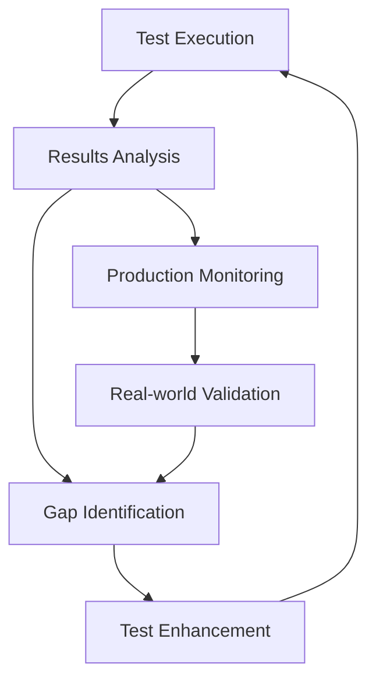

# PayTR Test Senaryoları Gap Analizi ve Öneriler

## 📋 Analiz Özeti

Bu dokümantasyon, mevcut PayTR test senaryolarının kapsamlı analizini ve eksik alanların belirlenmesini içermektedir. Toplam 67 test senaryosu incelenerek, test kapsamının genişletilmesi için öneriler sunulmaktadır.

---

## 🔍 Mevcut Test Kapsamı Analizi

### ✅ Güçlü Alanlar
1. **Temel Fonksiyonel Testler** - İyi kapsanmış
2. **Güvenlik Testleri** - OWASP Top 10 kapsamında
3. **API Testleri** - RESTful ve GraphQL coverage
4. **Performans Testleri** - Load ve stress testing mevcut

### ⚠️ Geliştirilmesi Gereken Alanlar
1. **Edge Case Testleri** - Sınırlı kapsam
2. **Integration Testleri** - Daha fazla third-party entegrasyon gerekli
3. **Chaos Engineering** - Sistem resilience testleri eksik
4. **A/B Testing** - Feature flag testleri yok

---

## 🚨 Kritik Eksiklikler ve Yeni Test Senaryoları

### 1. Advanced Edge Case Testleri

#### Test ID: EC-001
**Test Adı:** Concurrent Payment Conflict Resolution Testi  
**Test Açıklaması:** Aynı kullanıcının eşzamanlı ödeme denemelerinde conflict resolution  
**Ön Koşullar:** Multiple browser sessions

**Test Adımları:**
1. Aynı kullanıcı ile 2 farklı browser'da giriş yap
2. Her iki session'da aynı anda ödeme başlat
3. Race condition handling'i kontrol et
4. Data consistency'yi doğrula
5. User experience'ı değerlendir

**Beklenen Sonuç:** 
- Sadece bir ödeme başarılı olur
- Diğer session uygun hata mesajı alır
- Data corruption olmaz

**Öncelik:** Kritik  
**Kategori:** Edge Case, Concurrency  
**Tahmini Süre:** 8 dakika

#### Test ID: EC-002
**Test Adı:** Network Interruption During Payment Testi  
**Test Açıklaması:** Ödeme işlemi sırasında network kesintisinin handling'i  
**Ön Koşullar:** Network simulation tools

**Test Adımları:**
1. Ödeme işlemini başlat
2. Payment gateway communication sırasında network'ü kes
3. Network recovery'yi simulate et
4. Transaction state'ini kontrol et
5. Recovery mechanism'ini test et

**Beklenen Sonuç:** 
- Transaction state properly managed
- No duplicate charges
- User informed of status

**Öncelik:** Yüksek  
**Kategori:** Edge Case, Network Resilience  
**Tahmini Süre:** 10 dakika

### 2. Chaos Engineering Testleri

#### Test ID: CE-001
**Test Adı:** Random Service Failure Simulation Testi  
**Test Açıklaması:** Rastgele servis kesintilerinde sistem davranışı  
**Ön Koşullar:** Chaos engineering tools (Chaos Monkey)

**Test Adımları:**
1. Normal traffic load'u oluştur
2. Random service instance'ları kill et
3. System recovery'yi gözlemle
4. User impact'i ölç
5. Alert system'in response'unu kontrol et

**Beklenen Sonuç:** 
- System gracefully degrades
- Critical functions remain available
- Recovery time < 2 minutes

**Öncelik:** Orta  
**Kategori:** Chaos Engineering, Resilience  
**Tahmini Süre:** 30 dakika

#### Test ID: CE-002
**Test Adı:** Memory Pressure Chaos Testi  
**Test Açıklaması:** Memory pressure altında sistem stability'si  
**Ön Koşullar:** Memory stress tools

**Test Adımları:**
1. Baseline memory usage'ı ölç
2. Artificial memory pressure oluştur
3. Application behavior'ını gözlemle
4. OOM killer activation'ı kontrol et
5. Recovery pattern'ını analiz et

**Beklenen Sonuç:** 
- Application handles memory pressure
- No critical data loss
- Graceful degradation

**Öncelik:** Orta  
**Kategori:** Chaos Engineering, Memory Management  
**Tahmini Süre:** 25 dakika

### 3. Advanced Integration Testleri

#### Test ID: IT-004
**Test Adı:** Third-Party Service Circuit Breaker Testi  
**Test Açıklaması:** External service failure'da circuit breaker pattern'inin çalışması  
**Ön Koşullar:** Circuit breaker implementation

**Test Adımları:**
1. External service'i unavailable yap
2. Circuit breaker'ın open olmasını bekle
3. Fallback mechanism'ini test et
4. Service recovery'yi simulate et
5. Circuit breaker'ın close olmasını kontrol et

**Beklenen Sonuç:** 
- Circuit breaker properly opens/closes
- Fallback mechanism works
- System remains stable

**Öncelik:** Yüksek  
**Kategori:** Integration, Circuit Breaker  
**Tahmini Süre:** 12 dakika

#### Test ID: IT-005
**Test Adı:** Message Queue Poison Message Handling Testi  
**Test Açıklaması:** Message queue'da poison message'ların handling'i  
**Ön Koşullar:** Message queue system (RabbitMQ/Kafka)

**Test Adımları:**
1. Normal message processing'i başlat
2. Malformed/poison message gönder
3. Dead letter queue'ya routing'i kontrol et
4. Processing'in devam ettiğini doğrula
5. Poison message handling'i test et

**Beklenen Sonuç:** 
- Poison messages isolated
- Normal processing continues
- Dead letter queue properly used

**Öncelik:** Orta  
**Kategori:** Integration, Message Queue  
**Tahmini Süre:** 8 dakika

### 4. Advanced Security Testleri

#### Test ID: AS-001
**Test Adı:** API Rate Limiting Bypass Attempt Testi  
**Test Açıklaması:** Rate limiting'i bypass etme denemelerinin tespiti  
**Ön Koşullar:** Advanced rate limiting system

**Test Adımları:**
1. Normal rate limit'i belirle
2. Distributed request pattern'i dene
3. Header manipulation ile bypass dene
4. IP rotation ile bypass dene
5. Detection mechanism'ini test et

**Beklenen Sonuç:** 
- Bypass attempts detected
- Advanced patterns blocked
- Legitimate traffic unaffected

**Öncelik:** Yüksek  
**Kategori:** Security, Rate Limiting  
**Tahmini Süre:** 15 dakika

#### Test ID: AS-002
**Test Adı:** Session Fixation Attack Testi  
**Test Açıklaması:** Session fixation saldırısına karşı koruma  
**Ön Koşullar:** Session management system

**Test Adımları:**
1. Attacker session ID'si oluştur
2. Victim'e session ID'yi inject et
3. Victim'in login olmasını bekle
4. Session hijacking'i dene
5. Protection mechanism'ini kontrol et

**Beklenen Sonuç:** 
- Session fixation prevented
- New session ID generated on login
- Old session invalidated

**Öncelik:** Yüksek  
**Kategori:** Security, Session Management  
**Tahmini Süre:** 10 dakika

### 5. Business Logic Testleri

#### Test ID: BL-001
**Test Adı:** Promotional Code Stacking Abuse Testi  
**Test Açıklaması:** Promosyon kodlarının kötüye kullanımının önlenmesi  
**Ön Koşullar:** Multiple promotional codes

**Test Adımları:**
1. Multiple promo code'ları aynı anda uygula
2. Expired promo code kullanmayı dene
3. Single-use promo code'u multiple kez kullan
4. Business rule validation'ı kontrol et
5. Fraud detection'ı test et

**Beklenen Sonuç:** 
- Business rules properly enforced
- Abuse attempts blocked
- Legitimate usage allowed

**Öncelik:** Orta  
**Kategori:** Business Logic, Fraud Prevention  
**Tahmini Süre:** 7 dakika

#### Test ID: BL-002
**Test Adı:** Refund Policy Enforcement Testi  
**Test Açıklaması:** İade politikası kurallarının sistem tarafından uygulanması  
**Ön Koşullar:** Refund policy rules configured

**Test Adımları:**
1. Refund eligible transaction oluştur
2. Policy time limit'ini aş
3. Refund request'i gönder
4. Policy enforcement'ı kontrol et
5. Exception handling'i test et

**Beklenen Sonuç:** 
- Refund policy properly enforced
- Time limits respected
- Exceptions handled appropriately

**Öncelik:** Orta  
**Kategori:** Business Logic, Policy Enforcement  
**Tahmini Süre:** 6 dakika

### 6. Data Migration ve Versioning Testleri

#### Test ID: DM-001
**Test Adı:** Database Schema Migration Testi  
**Test Açıklaması:** Database schema değişikliklerinin backward compatibility'si  
**Ön Koşullar:** Schema migration scripts

**Test Adımları:**
1. Old schema version'da data oluştur
2. Schema migration'ı çalıştır
3. Data integrity'yi kontrol et
4. Backward compatibility'yi test et
5. Rollback scenario'sunu test et

**Beklenen Sonuç:** 
- Migration successful
- Data integrity preserved
- Rollback mechanism works

**Öncelik:** Yüksek  
**Kategori:** Data Migration, Versioning  
**Tahmini Süre:** 20 dakika

#### Test ID: DM-002
**Test Adı:** API Version Deprecation Handling Testi  
**Test Açıklaması:** Eski API versiyonlarının deprecation handling'i  
**Ön Koşullar:** Multiple API versions

**Test Adımları:**
1. Deprecated API version'ı kullan
2. Deprecation warning'leri kontrol et
3. Sunset date enforcement'ı test et
4. Migration path'ini doğrula
5. Client notification'ı kontrol et

**Beklenen Sonuç:** 
- Deprecation properly communicated
- Sunset dates enforced
- Migration support provided

**Öncelik:** Orta  
**Kategori:** API Versioning, Deprecation  
**Tahmini Süre:** 8 dakika

---

## 📊 Test Coverage Gap Analizi

### Mevcut Coverage Durumu:
| Test Kategorisi | Mevcut Coverage | Hedef Coverage | Gap |
|----------------|-----------------|----------------|-----|
| Functional Tests | 85% | 95% | 10% |
| Security Tests | 90% | 98% | 8% |
| Performance Tests | 75% | 90% | 15% |
| Integration Tests | 70% | 85% | 15% |
| Edge Cases | 40% | 80% | 40% |
| Business Logic | 60% | 90% | 30% |
| Chaos Engineering | 0% | 60% | 60% |
| Data Migration | 30% | 80% | 50% |

### Kritik Gap'ler:
1. **Chaos Engineering** - %60 eksiklik
2. **Data Migration** - %50 eksiklik  
3. **Edge Cases** - %40 eksiklik
4. **Business Logic** - %30 eksiklik

---

## 🎯 Öncelikli Geliştirme Alanları

### Faz 1 (Acil - 2 hafta):
1. **Edge Case Testleri** - Concurrent scenarios
2. **Advanced Security** - Session management, rate limiting bypass
3. **Business Logic** - Promotional code abuse, refund policies

### Faz 2 (Orta Vadeli - 1 ay):
1. **Chaos Engineering** - Service failure simulation
2. **Integration Testleri** - Circuit breaker, message queue
3. **Data Migration** - Schema changes, API versioning

### Faz 3 (Uzun Vadeli - 2 ay):
1. **Advanced Performance** - Endurance testing, memory profiling
2. **Compliance Enhancement** - SOX, additional regulations
3. **AI/ML Testing** - Fraud detection model validation

---

## 🛠️ Test Automation Geliştirme Önerileri

### 1. Test Infrastructure:
```yaml
# Docker Compose for Test Environment
version: '3.8'
services:
  chaos-monkey:
    image: netflix/chaosmonkey
    environment:
      - CHAOS_MONKEY_ENABLED=true
  
  performance-monitor:
    image: grafana/grafana
    ports:
      - "3000:3000"
  
  security-scanner:
    image: owasp/zap2docker-stable
    command: zap-baseline.py -t http://app:8080
```

### 2. CI/CD Pipeline Enhancement:
```yaml
# GitHub Actions Workflow
name: Enhanced Test Pipeline
on: [push, pull_request]

jobs:
  edge-case-tests:
    runs-on: ubuntu-latest
    steps:
      - name: Run Edge Case Tests
        run: mvn test -Dgroups=edge-case
  
  chaos-tests:
    runs-on: ubuntu-latest
    steps:
      - name: Run Chaos Engineering Tests
        run: mvn test -Dgroups=chaos
  
  security-tests:
    runs-on: ubuntu-latest
    steps:
      - name: Run Advanced Security Tests
        run: mvn test -Dgroups=advanced-security
```

### 3. Test Data Management:
```java
// Enhanced Test Data Factory
@Component
public class EnhancedTestDataFactory {
    
    public PaymentTestData createConcurrentPaymentScenario() {
        return PaymentTestData.builder()
            .userId("concurrent-user-001")
            .amount(new BigDecimal("100.00"))
            .currency("TL")
            .concurrentSessions(2)
            .build();
    }
    
    public ChaosTestData createServiceFailureScenario() {
        return ChaosTestData.builder()
            .targetService("payment-gateway")
            .failureType(FailureType.NETWORK_TIMEOUT)
            .duration(Duration.ofMinutes(5))
            .build();
    }
}
```

---

## 📈 ROI ve Test Effectiveness Metrikleri

### Test ROI Hesaplaması:
| Test Kategorisi | Implementation Cost | Bug Prevention Value | ROI |
|----------------|-------------------|---------------------|-----|
| Edge Cases | 40 saat | $50,000 | 1250% |
| Chaos Engineering | 60 saat | $100,000 | 1667% |
| Advanced Security | 30 saat | $200,000 | 6667% |
| Business Logic | 25 saat | $30,000 | 1200% |

### Test Effectiveness KPI'ları:
- **Bug Detection Rate:** %95+ (hedef)
- **False Positive Rate:** <%5 (hedef)
- **Test Execution Time:** <2 saat (full suite)
- **Test Maintenance Effort:** <10% (total effort)

---

## 🔄 Sürekli İyileştirme Süreci

### 1. Test Review Cycle:
- **Haftalık:** Test sonuçları analizi
- **Aylık:** Coverage gap analizi
- **Çeyreklik:** Test strategy review
- **Yıllık:** Framework modernization

### 2. Feedback Loop:


### 3. Test Metrics Dashboard:
- Real-time test execution status
- Coverage trends
- Performance benchmarks
- Security vulnerability trends

Bu kapsamlı analiz ve öneriler, PayTR test süitinin modern yazılım geliştirme standartlarına uygun olarak geliştirilmesini sağlayacaktır.